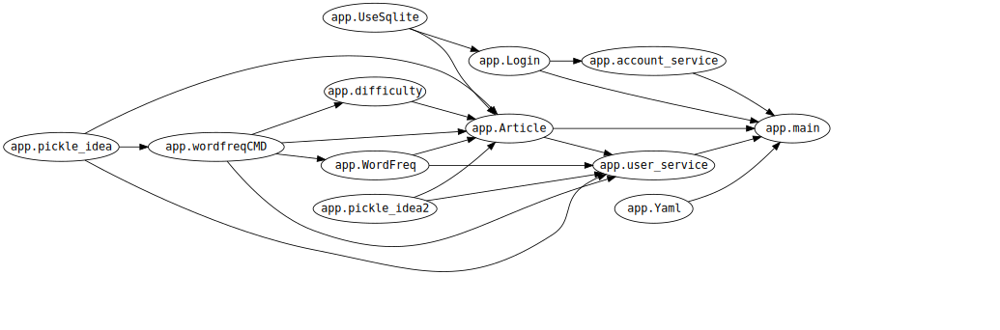
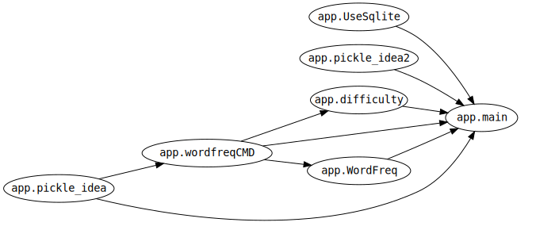
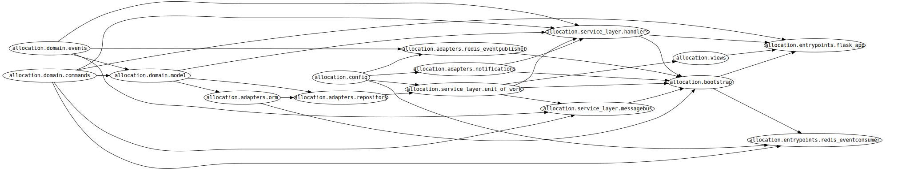

.. EnglishPal documentation master file, created by
   sphinx-quickstart on Thu May 12 08:26:36 2022.
   You can adapt this file completely to your liking, but it should at least
   contain the root `toctree` directive.
Lab1:Dependency Analysis and Dependency Graphs
======================================
小组成员：
'''''''''
201931990526   楼吉诚
""""""""
201931990524   李远帆
""""""""
201931990523   李森特
""""""""
201931990521   康净焮
""""""""
201931990528   潘林鑫
""""""""

Abstract
--------

找出EnglishPal中模块/类/函数之间的依赖关系，绘制依赖图，分析EnglishPal当前依赖关系利弊。

Introduction
------------

EnglishPal是智能捕捉阅读弱点，针对性提高用户的阅读水平的网站。提高用户的获取英文信息的速度与准确度。提供精选短文和生词簿，对于英语老师，EnglishPal
可以帮助掌握题目词汇规律，提高教学质量。对于英语学习者，EnglishPal可以帮助迅速提高词汇，轻松应对各种考试。本次实验针对EnglishPal源代码，分析当前模块级依赖关系以及类/函数级依赖关系，分析当前体系结构。

Methods and materials
---------------------

①Snakefood：从Python代码中生成依赖，过滤，聚类，并从依赖列表中生成图表。使用Snakefood捕获模块级依赖关系。

②Graphviz：开源的图形可视化软件。使用graphviz online渲染依赖关系图。

③Mermaid：基于Javascript的图表和图表工具，使用文本和代码创建图表和可视化，以便动态地创建和修改图表。使用mermaid
live editor渲染类/函数级依赖关系图。

Results
-------

BeginningOfSpring
~~~~~~~~~~~~~~~~~

snakefood.dot
^^^^^^^^^^^^^

::

   strict digraph "dependencies" {
       graph [
           rankdir="LR",
           overlap="scale",
           ratio="fill",
           fontsize="16",
           dpi="150",
           clusterrank="local"
       ]

       node [
           fontsize=14
           shape=ellipse
           fontname=Consolas
       ];

       "app.Login" -> "app.account_service"
       "app.difficulty" -> "app.Article"
       "app.pickle_idea" -> "app.Article"
       "app.pickle_idea2" -> "app.Article"
       "app.wordfreqCMD" -> "app.Article"
       "app.WordFreq" -> "app.Article"
       "app.UseSqlite" -> "app.Article"
       "app.wordfreqCMD" -> "app.difficulty"
       "app.UseSqlite" -> "app.Login"
       "app.user_service" -> "app.main"
       "app.Login" -> "app.main"
       "app.account_service" -> "app.main"
       "app.Yaml" -> "app.main"
       "app.Article" -> "app.main"
       "app.pickle_idea" -> "app.user_service"
       "app.pickle_idea2" -> "app.user_service"
       "app.wordfreqCMD" -> "app.user_service"
       "app.WordFreq" -> "app.user_service"
       "app.Article" -> "app.user_service"
       "app.wordfreqCMD" -> "app.WordFreq"
       "app.pickle_idea" -> "app.wordfreqCMD"

   }

依赖图
^^^^^^^^^^^^^

mermaid.txt
^^^^^^^^^^^^^

::

      account_service ..> Login
       Article ..> WordFreq
       Article ..>wordfreqCMD
       Article ..>RecordQuery
       Article ..>InsertQuery
       Article ..>difficulty
       Article ..>pickle_idea
       Article ..>pickle_idea2
       Login ..>RecordQuery
       Login ..>InsertQuery
       WordFreq ..>wordfreqCMD
       difficulty ..>  wordfreqCMD
       main..>Login
       main..>Article
       main..>user_service
       main..>account_service
       user_service..>Article
       user_service..>WordFreq
       user_service..>wordfreqCMD
       wordfreqCMD..>pickle_idea
       Sqlite3Template<|--RecordQuery
       Sqlite3Template<|--InsertQuery
   class account_service{
       signup()
       login()
       logout()
       reset()
   }
   class Article{
       total_number_of_essays()
       get_article_title(s)
       get_article_body(s)
       get_today_article(user_word_list, articleID)
       load_freq_history(path)
        within_range(x, y, r)
        get_question_part(s)
        get_answer_part(s)
   }
   class difficulty{
       load_record(pickle_fname)
       difficulty_level_from_frequency(word, d)
        get_difficulty_level(d1, d2)
        revert_dict(d)
        user_difficulty_level(d_user, d)
        text_difficulty_level(s, d)
   }
   class Login{
       verify_user(username, password)
       add_user(username, password)
       check_username_availability(username)
       change_password(username, old_password, new_password)
       get_expiry_date(username)
       md5(s)
   }
   class main{
       get_random_image(path)
       get_random_ads()
       appears_in_test(word, d)
       mark_word()
       mainpage()
   }
   class pickle_idea{
       lst2dict(lst, d)
        dict2lst(d)
        merge_frequency(lst1, lst2)
        load_record(pickle_fname)
        save_frequency_to_pickle(d, pickle_fname)
        unfamiliar(path,word)
        familiar(path,word)
   }
   class pickle_idea2{
       lst2dict(lst, d)
       deleteRecord(path,word)
       dict2lst(d)
       merge_frequency(lst1, lst2)
       load_record(pickle_fname)
       save_frequency_to_pickle(d, pickle_fname)
   }
   class user_service{
       user_reset(username)
       unfamiliar(username, word)
       familiar(username, word)
       deleteword(username, word)
       userpage(username)
       user_mark_word(username)
       get_time()
       get_flashed_messages_if_any()
   }
   class Sqlite3Template{
        __init__(self, db_fname)
       connect(self, db_fname)
       instructions(self, query_statement)
       operate(self)
       format_results(self)
       do(self)
       instructions_with_parameters(self, query_statement, parameters)
       do_with_parameters(self)
       operate_with_parameters(self)
   }
   class WordFreq{
       __init__(self, s)
       get_freq(self)
   }
   class wordfreqCMD{
       freq(fruit)
       youdao_link(s)
       file2str(fname)
       remove_punctuation(s)
       sort_in_descending_order(lst)
       sort_in_ascending_order(lst)
       make_html_page(lst, fname)

   }
   class RecordQuery{
        instructions(self, query)
        format_results(self)
        get_results(self)
   }
   class InsertQuery{
       instructions(self, query)
   }

类图
^^^^

ColdDew
^^^^^^^

snakefood.dot
^^^^^^^^^^^^^

::

   # This file was generated by snakefood3.

   strict digraph "dependencies" {
       graph [
               rankdir="LR",
               overlap="scale",
               ratio="fill",
               fontsize="16",
               dpi="150",
               clusterrank="local"
           ]

          node [
               fontsize=14
               shape=ellipse
               fontname=Consolas
          ];
       "app.wordfreqCMD" -> "app.difficulty"
       "app.UseSqlite" -> "app.main"
       "app.WordFreq" -> "app.main"
       "app.pickle_idea2" -> "app.main"
       "app.wordfreqCMD" -> "app.main"
       "app.pickle_idea" -> "app.main"
       "app.difficulty" -> "app.main"
       "app.wordfreqCMD" -> "app.WordFreq"
       "app.pickle_idea" -> "app.wordfreqCMD"
   }

依赖图
^^^^^^

mermaid.txt
^^^^^^^^^^^

::

   classDiagram
         Sqlite3Template <|-- InsertQuery
         Sqlite3Template <|-- RecordQuery
         wordfreqCMD <.. difficulty
         WordFreq <.. main
         wordfreqCMD <.. main
         UseSqlite <.. main
         difficulty <.. main
         wordfreqCMD <.. WordFreq

       class Sqlite3Template{
           __init__():
           connect():
           instructions():
           operate():
           format_results():
           do():
           instructions_with_parameters():
           do_with_parameters():
           operate_with_parameters():

       }
       class InsertQuery{
           instructions():
       }
       class RecordQuery{
           instructions():
           format_results():
           get_results():
       }

       class WordFreq{
           __init__():
           get_freq():

       }
       class difficulty{
           load_record():
           difficulty_level_from_frequency():
           get_difficulty_level():
           revert_dict():
           user_difficulty_level():
           text_difficulty_level():

       }
       class wordfreqCMD{
           freq():
           youdao_link(): 
           file2str():
           remove_punctuation():
           sort_in_descending_order():
           sort_in_ascending_order():
           make_html_page():
       }
       class main{
           get_random_image():
           get_random_ads():
           total_number_of_essays():
           load_freq_history():
           verify_user():
           add_user():
           check_username_availability():
           get_expiry_date():
           within_range():
           get_article_title():
           get_article_body():
           get_today_article():
           appears_in_test():
           get_time():
           get_question_part():
           get_answer_part():
           get_flashed_messages_if_any():
           user_reset():
           mark_word():
           mainpage():
           user_mark_word():
           unfamiliar():
           familiar():
           deleteword():
           userpage():
           signup():
           login():
           logout():
       }
       class pickle_idea{
           lst2dict():
           dict2lst():
           merge_frequency():
           load_record():
           save_frequency_to_pickle():
           unfamiliar():
           familiar():

       }
       class pickle_idea2{
           lst2dict():
           deleteRecord():
           dict2lst():
           merge_frequency():
           load_record():
           save_frequency_to_pickle():
       }

类图
^^^^

Chapter 4
~~~~~~~~~

snakefood.doc
^^^^^^^^^^^^^

::

   # This file was generated by snakefood3.

   strict digraph "dependencies" {
       graph [
               rankdir="LR",
               overlap="scale",
               ratio="fill",
               fontsize="16",
               dpi="150",
               clusterrank="local"
           ]
       
          node [
               fontsize=14
               shape=ellipse
               fontname=Consolas
          ];
       "allocation.config" -> "allocation.adapters.notifications"
       "allocation.domain.model" -> "allocation.adapters.orm"
       "allocation.domain.events" -> "allocation.adapters.redis_eventpublisher"
       "allocation.config" -> "allocation.adapters.redis_eventpublisher"
       "allocation.domain.model" -> "allocation.adapters.repository"
       "allocation.adapters.orm" -> "allocation.adapters.repository"
       "allocation.domain.events" -> "allocation.domain.model"
       "allocation.domain.commands" -> "allocation.domain.model"
       "allocation.service_layer.handlers" -> "allocation.entrypoints.flask_app"
       "allocation.bootstrap" -> "allocation.entrypoints.flask_app"
       "allocation.domain.commands" -> "allocation.entrypoints.flask_app"
       "allocation.views" -> "allocation.entrypoints.flask_app"
       "allocation.bootstrap" -> "allocation.entrypoints.redis_eventconsumer"
       "allocation.domain.commands" -> "allocation.entrypoints.redis_eventconsumer"
       "allocation.config" -> "allocation.entrypoints.redis_eventconsumer"
       "allocation.domain.commands" -> "allocation.service_layer.handlers"
       "allocation.adapters.notifications" -> "allocation.service_layer.handlers"
       "allocation.domain.events" -> "allocation.service_layer.handlers"
       "allocation.domain.model" -> "allocation.service_layer.handlers"
       "allocation.service_layer.unit_of_work" -> "allocation.service_layer.handlers"
       "allocation.domain.events" -> "allocation.service_layer.messagebus"
       "allocation.domain.commands" -> "allocation.service_layer.messagebus"
       "allocation.service_layer.unit_of_work" -> "allocation.service_layer.messagebus"
       "allocation.adapters.repository" -> "allocation.service_layer.unit_of_work"
       "allocation.config" -> "allocation.service_layer.unit_of_work"
       "allocation.adapters.redis_eventpublisher" -> "allocation.bootstrap"
       "allocation.adapters.orm" -> "allocation.bootstrap"
       "allocation.service_layer.messagebus" -> "allocation.bootstrap"
       "allocation.service_layer.handlers" -> "allocation.bootstrap"
       "allocation.adapters.notifications" -> "allocation.bootstrap"
       "allocation.service_layer.unit_of_work" -> "allocation.bootstrap"
       "allocation.service_layer.unit_of_work" -> "allocation.views"
   }

依赖图
^^^^^^

mermaid.txt
^^^^^^^^^^^

::

   classDiagram
    class commands
    class InvalidSku
    class bootstrap
    class views
    class config
    class events
    class model
    class OrderLine
    class repository
    class flask_app{
        add_batch()
        allocate_endpoint()
        allocations_view_endpoint(orderid)
    }
    class redis_eventconsumer{
        main()
        handle_change_batch_quantity()
    }
    class handlers{
        add_batch()
        llocate()
        reallocate()
        change_batch_quantity()
        send_out_of_stock_notification()
        publish_allocated_event()
        add_allocation_to_read_mode()
        remove_allocation_from_read_model()
    }
    class messagebus{
        __init__()
        handle()
        handle_event()
        handle_command()
    }
    class AbstractUnitOfWork{
       __enter__()
       __exit__()
       commit()
       collect_new_events()
       _commit()
       rollback()
    }
    class SqlAlchemyUnitOfWork{
       __init__()
       __enter__()
       __exit__()
       _commit()
       rollback()
    }
    class unit_of_work
   unit_of_work *-- AbstractUnitOfWork
   unit_of_work *-- SqlAlchemyUnitOfWork
   handlers *-- InvalidSku
   flask_app ..> InvalidSku
   flask_app ..> commands
   flask_app ..> bootstrap
   flask_app ..> views
   redis_eventconsumer ..> config
   redis_eventconsumer ..> commands
   redis_eventconsumer ..> bootstrap
   handlers ..> commands
   handlers ..> events
   handlers ..> model
   handlers ..> OrderLine
   messagebus ..> commands
   messagebus ..> events
   unit_of_work ..> repository
   unit_of_work ..> config

类图
^^^^

架构利弊分析
~~~~~~~~~~~~

优点：重构后增加了Arcticle , Login,User_service
等模块，把原来分散在各个文件的操作统一管理封装，使其更符合业务逻辑。模块关系更加清晰，易于扩展。
缺点：冗余代码过多，增加项目复杂度。

--------------

Table 1
~~~~~~~

+--------------------------------------+---------+-------------------+
| question                             | ColdDew | BeginningOfSpring |
+======================================+=========+===================+
| Lines of code in main.py (excluding  | 498     | 114               |
| blank lines)                         |         |                   |
+--------------------------------------+---------+-------------------+
| Number of HTML files in folder       | 2       | 9                 |
| templates                            |         |                   |
+--------------------------------------+---------+-------------------+
| Has a service layer? Answer Yes or   | No      | Yes               |
| No.                                  |         |                   |
+--------------------------------------+---------+-------------------+
| Front-end and back-end coupling.     | Weak    | Strong            |
| Answer Strong or Weak.               |         |                   |
+--------------------------------------+---------+-------------------+
| Number of module-level dependencies  | 9       | 21                |
+--------------------------------------+---------+-------------------+

ColdDew : 2 BeginningOfSpring : 4

BeginningOfSpring 更容易理解和维护。 理由： 1.
BeginningOfSpring版本将原本全部堆积在main.py中的大量功能性代码进行了分类，这样在未来如果某项功能出现错误，可以更快地定位错误发生的位置。
2.
BeginningOfSpring版本将原本混杂在main.py中的html代码移出到template中，使代码更加简洁。

End
~~~

.. |image0| image:: https://github.com/ljc5432/EnglishPal/blob/main/image/BeginningOfSpringDependency.jpg?raw=true
.. |image1| image:: https://raw.githubusercontent.com/ljc5432/EnglishPal/main/image/BeginningOfSpringClass.svg
.. |image2| image:: https://raw.githubusercontent.com/ljc5432/EnglishPal/e6757d30ec0f8e3121f1a53bc7ffa73258b8cd9e/image/ColdDewDependency.svg
.. |image3| image:: https://raw.githubusercontent.com/ljc5432/EnglishPal/e6757d30ec0f8e3121f1a53bc7ffa73258b8cd9e/image/ColdDewClass.svg
.. |image4| image:: https://raw.githubusercontent.com/ljc5432/EnglishPal/e6757d30ec0f8e3121f1a53bc7ffa73258b8cd9e/image/Chapter4Dependency.svg
.. |image5| image:: https://raw.githubusercontent.com/ljc5432/EnglishPal/e6757d30ec0f8e3121f1a53bc7ffa73258b8cd9e/image/Chapter4Class.svg
